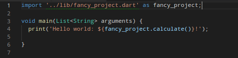
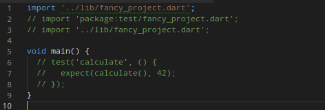
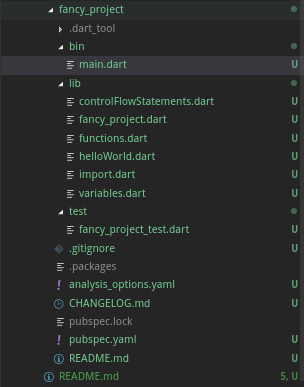

# Pengenalan Stagehand Pada Dart
### Instalasi Stagehand di Device Anda
Agar dapat menjalankan stagehand, pastikan terlebih dahulu bahwa dart telah masuk ke dalam direktori /home/username/.profile Anda jika anda menggunakan sistem operasi Arch Linux (Manjaro). Jalankan perintah berikut di command line anda untuk mengecek dart PATH telah terinstall dengan baik

    cat /home/username-anda/.profile

Pastikan output dari perintah tersebut terdapat baris perintah

    export PATH="$PATH:/usr/lib/dart/bin"

Jika belum ada, tambahkan path tersebut ke dalam file .profile yang anda miliki. Setelah menambahkan path tersebut, pastikan di file /home/username/.bashrc terdapat baris kode berikut

    export PATH="$PATH":"$HOME/.pub-cache/bin"

Setelah semua telah berjalan dengan baik, jalankanlah perintah di bawah ini untuk menginstall Stagehand di device anda.

    pub global activate stagehand

Lalu tunggu hingga seluruh instalasi telah berhasil dengan sempurna. Selamat anda telah berhasil menginstall Stagehand di device Anda. Mari kita ke langkah berikutnya untuk memulai project pertama kita.

### Memulai Project Dengan Stagehand
Pastikan saat ini Anda berada di dalam direktori tempat project yang akan anda simpan. Kemudian jalankan kode berikut untuk membuat project stagehand Anda. Pada kesempatan kali ini saya menyimpan project Stagehand saya di folder **fancy_project** dengan menggunakan template console-full.

    stagehand package-simple

Berdasarkan pengalaman saya terjadi syntax error pada saat pertama kali men-generate Stagehand. Saya memperbaikinya dengan mengganti syntax pada bagian import. Berikut adalah hasil dari modifikasi pada saat pertama kali membuat Stagehand.

Perubahan di folder **bin**

Berikut perubahan pada **lib**

Berikut adalah direktori hasil menjalankan program Stagehand 

